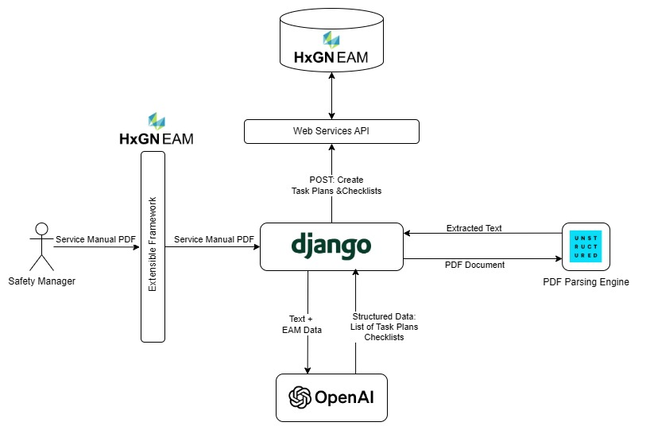

# Service Manuals Assistant

The **Service Manuals Assistant** application automates the creation of Task Plans and Checklists in HxGN EAM by analyzing unstructured PDF documents like equipment service manuals and technical bulletins.

## Application Goal

This assistant uses the same PDF-processing architecture as the other assistants. Its specific goal is to read a technical service manual and extract one or more **Task Plans** and their corresponding **Checklists**. Unlike the `Maintenance Assistant`, it does not create an overarching PM Schedule; it focuses solely on the Task Plans themselves, which can then be used independently or linked to work orders in EAM.

*Note: Please add the architecture diagram for this app to the `DOCS/images` folder as `service_manuals_assistant_architecture.jpg` for it to be displayed here.*


## Data Flow Differences

1. **Input**: The process starts with a **Service Manual PDF** identified by a `document_code`.
2. **LLM Goal**: The LLM is prompted to act as an expert at creating standardized work orders from technical documents. Its goal is to identify distinct maintenance procedures within the manual and structure them as a list of Task Plans.
3. **Structured Data**: The LLM returns a JSON object that conforms to the `TaskPlanListContainer` schema. This container holds a list of `TaskPlan` objects. This is a key difference from the `Maintenance Assistant`, which returns a single `MaintenanceSchedule` object.
4. **EAM Creation**: If `create_in_eam` is true, the application iterates through the list of extracted `TaskPlan` objects. For each one, it makes two types of calls to the `EAMApiService`:
    - A call to `create_task_plan`.
    - Multiple calls to `create_checklist` for each step in the task plan.

## Key Components

### Views (`views.py`)

- **`ProcessServiceManualDocumentView`**: The API endpoint that orchestrates the entire process.

### Services (`services/service_manuals_assistant.py`)

- **`ServiceManualsAssistantService`**: Contains the core logic for PDF parsing and LLM interaction. The system prompt used here is specifically tailored to extract multiple `TaskPlan` objects from a single document.

### Schemas (`schemas.py`)

- **`TaskPlanListContainer`**: The top-level Pydantic model that holds a list of task plans.
- **`TaskPlan`**: Defines a task plan with its code, description, and a nested list of `ChecklistItem` objects.
- **`ChecklistItem`**: Defines an individual checklist step.

## API Endpoint

### Process Service Manual Document

- **Endpoint**: `POST /api/service-manuals/process-document/` (Confirm base path in project `urls.py`)
- **Description**: Processes a service manual from EAM to extract one or more Task Plans and optionally create them in the system.
- **Request Body**:

    ```json
    {
        "document_code": "SVC-MAN-PUMP-01",
        "create_in_eam": true
    }
    ```

- **Success Response**:

    ```json
    {
        "extracted_data": [
            {
                "task_code": "TP_PUMP_OVERHAUL",
                "description": "Complete overhaul of Pump Model X",
                "checklist": [
                    {
                        "checklist_id": "CL_DISASSEMBLY",
                        "description": "Step 1: Verify pump is isolated and LOTO is applied"
                    },
                    {
                        "checklist_id": "CL_INSPECT_SHAFT",
                        "description": "Step 2: Inspect shaft for wear and runout"
                    }
                ]
            }
        ],
        "created_in_eam": [
             {
                "task_code": "TP_PUMP_OVERHAUL",
                "description": "Complete overhaul of Pump Model X",
                "api_response": { "...EAM response for task creation..." },
                "checklists": [
                    {
                        "checklist_id": "CL_DISASSEMBLY",
                        "description": "Step 1: Verify pump is isolated and LOTO is applied",
                        "api_response": { "...EAM response for checklist creation..." }
                    }
                ]
            }
        ]
    }
    ```
